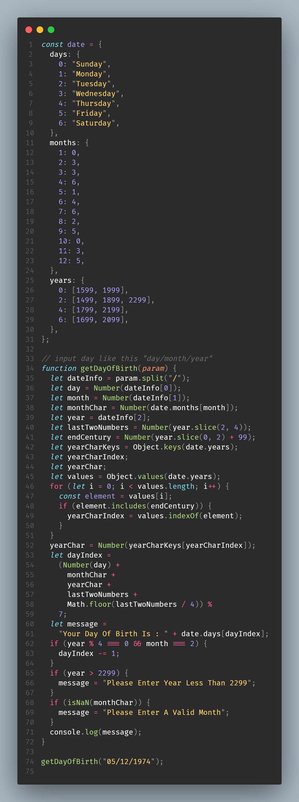

# Get-Day-Of-Birth
## Overview

### The challenge

Users should be able to:

- View the optimal layout for the site depending on their device's screen size
- See hover states for all interactive elements on the page

### Screenshot




### Links

- Solution URL: [Github Repo](https://github.com/abdelrhman492/Get-Day-Of-Birth)
### Built with

- JavaScript
- Day Char Code
- Month Char Code
- Century Char Code

#### I Learn very important information like day & month & century charts code </br> and these infos help me to solve this code
</br>
</br>
</br>

To see how you can add code snippets, see below:

```JS
const date = {
  days: {
    0: "Sunday",
    1: "Monday",
    2: "Tuesday",
    3: "Wednesday",
    4: "Thursday",
    5: "Friday",
    6: "Saturday",
  },
  months: {
    1: 0,
    2: 3,
    3: 3,
    4: 6,
    5: 1,
    6: 4,
    7: 6,
    8: 2,
    9: 5,
    10: 0,
    11: 3,
    12: 5,
  },
  years: {
    0: [1599, 1999],
    2: [1499, 1899, 2299],
    4: [1799, 2199],
    6: [1699, 2099],
  },
};
```